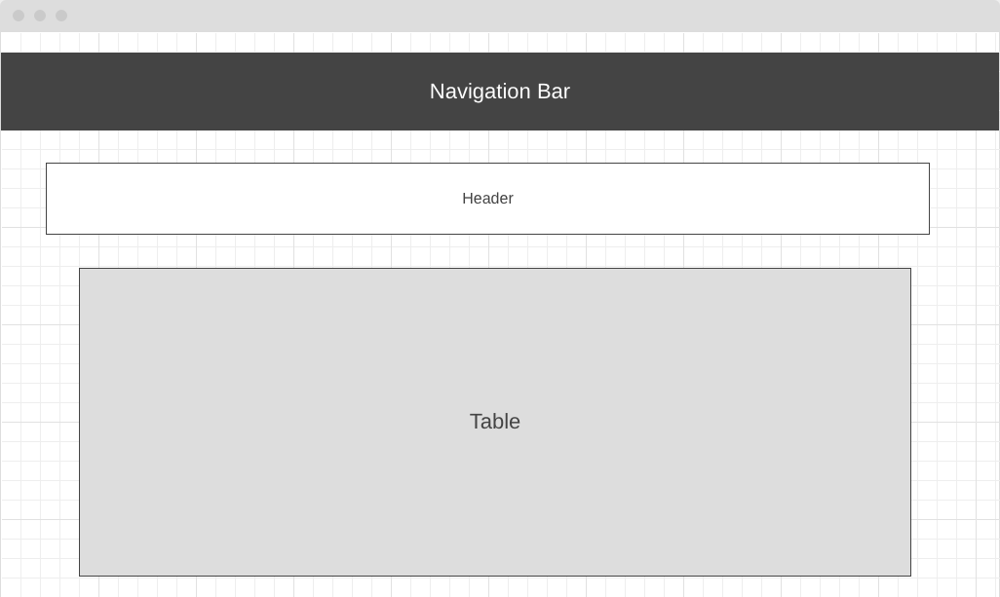

# Project Title

Football News

## Description

This app is covering European football news, such as Scheduled matches, results of matches and Standings Tables of top five leagues.

This app is collecting data from one of free football API.

### Technical Used
I use the following to build this game:

```
React
CSS
JavaScript
React Route
React DOM manipulation
Bootstrap
Axios
```

### Planning and Development Process 

Stage 1:
* Create app in react with necessary components.
* Search for football API
* Build the first style with CSS and react-bootstrap.
* Start write the code.

Stage 2:
* Create Route path to the components.
* Add DOM event to the buttons
* Add some style useing React-Bootstrab and CSS.

Stage 3:
* Finalize style sheet.
* Fix the bugs.
* Deploy.

---

### Wireframe
* Home page


* Second page


### User Stories

As a user, you have two types of information to get the following:
First: Standings tables of the top five euro leagues. 
Second: Today's matches details.

---

### Problem-Solving Strategy
Using console.log sometimes to see the exact result 

---


 ## References
 * API Source: https://www.football-data.org/
 * React Bootstrap: https://react-bootstrap.github.io/
 * Project link: http://football-react-app.herokuapp.com/

